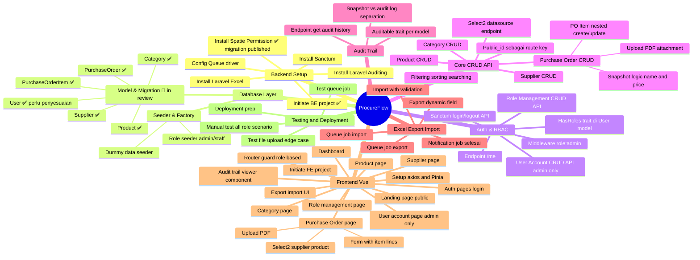

```mermaid
mindmap
  root((ProcureFlow))
    Backend Setup
      Initiate BE project ✅
      Install Sanctum
      Install Spatie Permission ✅ migration published
      Install Laravel Auditing
      Install Laravel Excel
      Config Queue driver
    Database Layer
      Model & Migration 🔄 in review
        Supplier ✅
        Category ✅
        Product ✅
        PurchaseOrder ✅
        PurchaseOrderItem ✅
        User ✅ perlu penyesuaian
      Seeder & Factory
        Role seeder admin/staff
        Dummy data seeder
    Auth & RBAC
      Sanctum login/logout API
      Endpoint /me
      HasRoles trait di User model
      Middleware role:admin
      Role Management CRUD API
      User Account CRUD API admin only
    Core CRUD API
      Supplier CRUD
      Category CRUD
      Product CRUD
      Purchase Order CRUD
        PO Item nested create/update
        Snapshot logic name and price
        Upload PDF attachment
      Filtering sorting searching
      Select2 datasource endpoint
      Public_id sebagai route key
    Audit Trail
      Auditable trait per model
      Endpoint get audit history
      Snapshot vs audit log separation
    Excel Export Import
      Export dynamic field
      Import with validation
      Queue job export
      Queue job import
      Notification job selesai
    Frontend Vue
      Initiate FE project
      Setup axios and Pinia
      Auth pages login
      Router guard role based
      Landing page public
      Dashboard
      Role management page
      User account page admin only
      Supplier page
      Category page
      Product page
      Purchase Order page
        Form with item lines
        Select2 supplier product
        Upload PDF
      Audit trail viewer component
      Export import UI
    Testing and Deployment
      Manual test all role scenario
      Test file upload edge case
      Test queue job
      Deployment prep
```